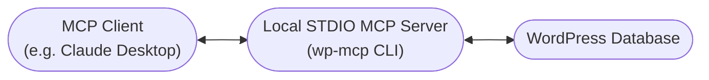
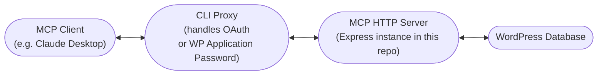

# wp-mcp

`@rnaga/wp-mcp` is a Model Context Protocol (MCP) server for WordPress that turns your site into an AI-operable surface. By exposing WordPress CRUD primitives to clients like Claude Desktop, an assistant can draft a post on demand, refine it collaboratively, and publish it straight into your database—no trip through wp-admin required.

Here are a few common scenarios this unlocks:

- Draft, revise, and publish posts directly from MCP clients such as Claude Desktop.
- Inspect WordPress users, their roles, and capabilities to audit site permissions or generate access reports.

Built on top of [`@rnaga/wp-node`](https://github.com/rnaga/wp-node), the server ships with a curated MCP toolset covering posts, users, comments, terms, revisions, metadata, options, and site settings. The MCP server can manage the following database tables/resources:

| Resource           | What you can do                                                                        |
| ------------------ | -------------------------------------------------------------------------------------- |
| Posts              | Create, update, read, or delete posts and their revisions.                             |
| Comments           | Moderate discussion threads or inject generated replies.                               |
| Users              | Onboard contributors, adjust roles, or disable accounts with native capability checks. |
| Terms              | Manage categories, tags, and custom taxonomies.                                        |
| Metadata           | Inspect, create, update, or delete post, user, comment, term, and site meta fields.    |
| Settings & Options | Toggle site-level configuration safely.                                                |

You can spin up a **STDIO server** for direct database access or host a **Streamable HTTP MCP server** for remote access. For convenience, layer on the **CLI proxy** whenever your MCP client needs a local bridge to the HTTP server. The proxy behaves like a local MCP server while relaying requests to the HTTP endpoint—perfect for clients that lack OAuth or WordPress Application Password support—so you can fit MCP workflows into existing editorial pipelines without re-implementing WordPress business logic.

The project includes a CLI (`wp-mcp`) that helps you:

- configure and launch a local STDIO MCP server that connects straight to your WordPress database;
- scaffold and initialize an Express-based Streamable HTTP MCP server (with env/TS boilerplate);
- authenticate against a remote WordPress environment (OAuth or Application Password) and run a JSON-RPC proxy so MCP clients can reach it securely;
- inspect available MCP primitives and manage the credentials stored under `~/.wp-mcp`.

Run this command to list the available CLI commands:

```
npx @rnaga/wp-mcp -- --help
```

```
Usage: <command> <subcommand> [options]

Commands:
   local            Local MCP (stdio) server commands
   utils            Utility commands for configuration, debugging, and MCP inspection
   http             Scaffold a TypeScript project for the MCP streamable HTTP server and related tooling.
   remote           Remote MCP server commands
```

Together, the server, CLI utilities, and proxy tooling let you CRUD WordPress content, manage users, and sync settings through the MCP standard without re-implementing WordPress logic.

## Getting Started

### Local STDIO server

Run the STDIO server when you can reach the database directly. The CLI launches an MCP process that assumes a WordPress user locally and exposes your site's tools over STDIO to the MCP client.



1. Run the CLI to set up the database connection:
   ```sh
   npx @rnaga/wp-mcp -- local config-set
   ```
   The CLI prompts you for `host`, `port`, `database name`, `user`, and `password`. If your database requires SSL, you can provide CA, cert, and key file paths to secure remote access. Run `npx @rnaga/wp-mcp local config` anytime to review the saved values.
2. Configure your MCP client to launch the server. For **Claude Desktop**, open Settings → Developer → Edit Config and add this to your `claude_desktop_config.json`:

   ```json
   {
     "mcpServers": {
       "wp-mcp": {
         "command": "npx",
         "args": ["-y", "@rnaga/wp-mcp", "--", "local", "start"],
         "env": {
           "LOCAL_USERNAME": "wp-admin"
         }
       }
     }
   }
   ```

   **Activate the server:** Save the config file, then quit and restart your MCP client (for example, Claude Desktop). The WordPress tools will now appear in the MCP indicator at the bottom right of the chat input.

   **Important:** Replace `wp-admin` with your WordPress username. The server uses this to determine which MCP primitives are available based on the user's WordPress capabilities. For example, administrator roles get full access to all primitives (create, update, delete posts, manage users, etc.), while subscriber roles see only limited tools. This capability-based filtering prevents accidental execution of privileged operations. To see which primitives are available and the required capabilities and roles for each:

   ```sh
   npx @rnaga/wp-mcp -- utils list-prims
   ```

   This displays a table showing the primitive name, title, description, required capabilities, and allowed roles.

   **Optional:** Provide a WordPress config manifest if your project defines one (e.g., `src/_wp/config/wp.json`). Set `LOCAL_CONFIG` in the `env` object above to the absolute path of your config file. If you don't have a custom config, omit this environment variable entirely. For the configuration manifest schema, see https://rnaga.github.io/wp-node/docs/getting-started/configuration.

   **Testing the MCP server:**

   Use the MCP Inspector for interactive testing and debugging:

   ```sh
   npx -y @modelcontextprotocol/inspector npx @rnaga/wp-mcp local start -u wp-admin
   ```

   This opens a visual interface at `http://localhost:6274` where you can explore available tools, test them with different arguments, and inspect server responses.

Usage reference for CLI flags and environment variables:

| Environment variable                                                                                                                                                                                                                                               | CLI flag                            | Purpose                            | When it is read                                                                                                      |
| ------------------------------------------------------------------------------------------------------------------------------------------------------------------------------------------------------------------------------------------------------------------ | ----------------------------------- | ---------------------------------- | -------------------------------------------------------------------------------------------------------------------- |
| `LOCAL_USERNAME`                                                                                                                                                                                                                                                   | `--username <value>` / `-u <value>` | WordPress username to assume       | Used by `local start` to pick the WP user whose roles and capabilities determine available MCP primitives.           |
| `LOCAL_CONFIG`                                                                                                                                                                                                                                                     | `--file <path>` / `-f <path>`       | WordPress config manifest location | Used by `local start` to point the init hook at a custom WP config JSON.                                             |
| `DB_ENVIRONMENT`, `WP_DB_HOST`, `WP_DB_PORT`, `WP_DB_NAME`, `WP_DB_USER`, `WP_DB_PASSWORD`, `LOCAL_MULTISITE`, `LOCAL_DEFAULT_BLOG_ID`, `LOCAL_DEFAULT_SITE_ID`, `LOCAL_SSL_ENABLED`, `LOCAL_SSL_CA_FILEPATH`, `LOCAL_SSL_CERT_FILEPATH`, `LOCAL_SSL_KEY_FILEPATH` | _(wizard via `local config-set`)_   | Local database connection details  | Loaded by the secret store before `local start`; populate them with `local config-set` or export them ahead of time. |

### MCP Streamable HTTP server

Use the HTTP server when you need to expose MCP over the Internet or let remote teammates connect. The CLI scaffolds an Express app (see `src/http/express/index.ts`) that exposes both the MCP streaming HTTP transport and the SSE fallback while reusing the same primitive registry.

1. **Scaffold a project**

   ```sh
   npx @rnaga/wp-mcp -- http init
   ```

   The wizard prompts for database connection details, creates a `wp-node` project, and seeds Express boilerplate plus TypeScript configuration for the HTTP transport.

   Resulting layout:

   ```
   ├── _wp
   │   ├── config
   │   │   ├── index.d.ts
   │   │   └── wp.json
   │   └── settings.ts
   ├── .env
   ├── .gitignore
   ├── index.ts
   ├── package-lock.json
   ├── package.json
   ├── src
   │   └── index.ts
   └── tsconfig.json
   ```

   Populate `.env` with the values requested by the scaffolder and any HTTP-specific environment variables listed later in this document.

2. **Run the server in development**

   ```sh
   npm run dev
   ```

   This relies on `ts-node` so you can iterate without precompiling.

3. **Build and run in production**

   ```sh
   npm run build
   npm run start
   ```

   The compiled output boots the same Express server that `createHttpServer` wires together in the library.

### Connect via the Remote Proxy CLI

Use the remote proxy when your MCP client only understands STDIO or lacks full OAuth support but the WordPress environment is available over HTTP. The proxy keeps credentials in `~/.wp-mcp` and relays MCP requests to the remote server with the right Authorization header.



1. **Authenticate once**

   Begin by enrolling the proxy with either WordPress Application Password credentials or an OAuth device flow so it can sign requests on behalf of your MCP client.

   - **WordPress Application Password**

     ```sh
     npx @rnaga/wp-mcp -- remote login password
     ```

     Provide the authorization URL for your server (for example `http://localhost:3000`), then enter the WordPress username and application password. The credentials are stored securely so future proxy runs can supply HTTP Basic auth automatically (WordPress Application Passwords are transmitted via the Basic scheme.)

     Inspect the stored values with:

     ```sh
     npx @rnaga/wp-mcp -- remote config
     ```

   - **OAuth device flow**

     ```sh
     npx @rnaga/wp-mcp -- remote login oauth
     ```

     The CLI calls `/auth/device/start`, prints the user code, and opens the verification URL in your browser. After you complete the device flow, the access and refresh tokens are written to `~/.wp-mcp`. You can re-run `remote config` or `remote revoke-token` as needed.

   Use `npx @rnaga/wp-mcp -- remote config-clear` if you ever need to remove stored secrets.

2. **Start the proxy**

Configure Claude Desktop (or another MCP client) the same way you do for the local STDIO server, but point the command to the proxy:

```json
{
  "mcpServers": {
    "wp-mcp": {
      "command": "npx",
      "args": ["-y", "@rnaga/wp-mcp", "--", "remote", "proxy"],
      "env": {
        "REMOTE_AUTH_TYPE": "oauth",
        "REMOTE_URL": "https://wp-mcp.example.com/mcp"
      }
    }
  }
}
```

Adjust the `REMOTE_AUTH_TYPE` (`oauth` or `password`) and `REMOTE_URL` to match your remote endpoint. You can also pass these at runtime with `--authType` and `--remoteUrl`. The proxy validates your saved credentials, refreshes OAuth tokens when they are within five minutes of expiry, and then exposes a local STDIO MCP server that delegates every call to the remote HTTP transport.

Once running, your client speaks STDIO locally while the proxy relays traffic to the remote Express server.

## Streamable HTTP Server Internals

The Streamable HTTP deployment bundles Express middleware that bootstraps a WordPress context on each request, registers both the streaming HTTP and SSE transports, and layers in caching plus OAuth metadata handlers. The remote server operates as an OAuth 2.0 **resource server** — clients must supply either a bearer token or a WordPress Application Password, and the server never behaves as an OAuth client itself. Discovery metadata is served from `/.well-known/oauth-protected-resource`, keeping the implementation aligned with RFC 9728.

The CLI's device-code helper (`npx @rnaga/wp-mcp -- remote login oauth`) extends the MCP tooling with a terminal-friendly flow. It talks to the server's `/auth/device/*` endpoints, stores the resulting tokens in the secret vault (`~/.wp-mcp`), and enables the proxy to refresh and attach bearer credentials automatically.

### Access Control

The HTTP layer applies authentication across `/mcp` and `/sse` so only authorized callers can negotiate sessions. It supports:

- **OAuth Bearer tokens** – validated through the configured provider, with access tokens mapped to WordPress users before the MCP session initializes.
- **WordPress Application Passwords** – accepted over HTTP Basic auth and verified before the WordPress user is assumed server-side.

Failed bearer requests receive RFC 6750-compliant `WWW-Authenticate` headers that include the authorization URI and requested scopes so clients can recover gracefully.

### Endpoints

| Path                                    | Purpose                                                                                       |
| --------------------------------------- | --------------------------------------------------------------------------------------------- |
| `/mcp`                                  | Streamable HTTP MCP transport for client-to-server requests and session lifecycle management. |
| `/sse`                                  | Legacy SSE transport for clients that require server-sent events.                             |
| `/messages`                             | Allows SSE clients to post user messages back to the server.                                  |
| `/auth/device/start`                    | Initiates OAuth device authorization flow.                                                    |
| `/auth/device/poll`                     | Polls for OAuth device flow completion and returns tokens.                                    |
| `/auth/refresh`                         | Exchanges a refresh token for a new access token.                                             |
| `/auth/revoke`                          | Revokes an access token at the provider.                                                      |
| `/auth/userinfo`                        | Returns the WordPress user associated with the supplied Authorization header.                 |
| `/auth/password`                        | Validates a WordPress Application Password and returns the associated user.                   |
| `/.well-known/oauth-protected-resource` | Serves OAuth resource metadata for discovery tooling.                                         |

### Supported OAuth providers

The server ships with provider profiles for GitHub, Google, and Auth0. Each profile encapsulates device-code issuance, token polling, refresh, and revocation logic that can be wired in when you instantiate the HTTP server. To use a different identity system, supply your own provider implementation through the same hook and keep the rest of the deployment unchanged.

#### Setting up OAuth providers

To enable OAuth authentication, you need to register an application with your chosen provider and configure the credentials in your environment variables.

##### GitHub OAuth Setup

1. **Create an OAuth App**: Navigate to [GitHub Developer Settings](https://github.com/settings/developers) > OAuth Apps > "New OAuth App"
2. **Configure your application**:
   - **Application Name**: Your app's display name
   - **Homepage URL**: Your application's homepage
   - **Authorization Callback URL**: Your OAuth callback endpoint
3. **Get credentials**: After creation, note your **Client ID** and generate a **Client Secret**
4. **Set environment variables**:
   ```bash
   OAUTH_CLIENT_ID=your_github_client_id
   OAUTH_CLIENT_SECRET=your_github_client_secret
   ```
5. **Documentation**: [GitHub OAuth Apps Documentation](https://docs.github.com/en/apps/oauth-apps/building-oauth-apps/creating-an-oauth-app)

##### Google OAuth Setup

1. **Access Google Cloud Console**: Go to [Google Cloud Console](https://console.cloud.google.com/apis/credentials)
2. **Create OAuth credentials**: Navigate to Menu > APIs & Services > Credentials > Create Credentials > OAuth client ID
3. **Configure OAuth consent screen**: Set up app name, user support email, and audience settings
4. **Select application type**: Choose the appropriate type (Web application, Desktop app, etc.)
5. **Get credentials**: Note your **Client ID** and **Client Secret**
6. **Set environment variables**:
   ```bash
   OAUTH_CLIENT_ID=your_google_client_id
   OAUTH_CLIENT_SECRET=your_google_client_secret
   ```
7. **Documentation**: [Setting up OAuth 2.0 in Google Cloud](https://support.google.com/cloud/answer/6158849)

##### Auth0 OAuth Setup

1. **Create application**: Register a **Native Application** in your [Auth0 Dashboard](https://manage.auth0.com/)
2. **Configure grant types**: In Application Settings > Advanced > Grant Types, enable:
   - **Device Code** (required for device flow)
   - **Refresh Token** (optional, for token refresh)
3. **Enable OIDC Conformant**: In Application Settings > Advanced > OAuth, ensure OIDC Conformant is enabled
4. **Configure connections**: Set up and enable at least one connection for the application
5. **Get credentials**: Note your **Client ID**, **Client Secret**, and **Domain**
6. **Set environment variables**:
   ```bash
   OAUTH_DOMAIN=your-tenant.us.auth0.com
   OAUTH_CLIENT_ID=your_auth0_client_id
   OAUTH_CLIENT_SECRET=your_auth0_client_secret
   ```
7. **Documentation**: [Auth0 Device Authorization Flow](https://auth0.com/docs/get-started/authentication-and-authorization-flow/device-authorization-flow)

### Usage reference for environment variables

The HTTP server loads its configuration from environment variables—typically via a local `.env` file, inherited process environment, or settings provided by your hosting platform.

| Environment variable              | Purpose                                            | Example value                                          | When it is read                                                                                |
| --------------------------------- | -------------------------------------------------- | ------------------------------------------------------ | ---------------------------------------------------------------------------------------------- |
| `OAUTH_RESOURCE_URL`              | Public URL of the protected resource               | `https://mcp.example.com`                              | Included in OAuth resource metadata and DNS-rebinding protection checks.                       |
| `OAUTH_RESOURCE_NAME`             | Display name for the protected resource            | `Example WordPress MCP`                                | Returned in discovery metadata.                                                                |
| `OAUTH_SCOPES_SUPPORTED`          | Comma-separated scopes supported by the resource   | `openid,offline_access,posts.read`                     | Advertised in discovery metadata and `WWW-Authenticate` headers.                               |
| `OAUTH_SERVICE_DOCUMENTATION_URL` | Documentation link for the resource                | `https://docs.example.com/mcp`                         | Returned in discovery metadata.                                                                |
| `OAUTH_AUTHORIZATION_URL`         | Authorization server URL                           | `https://auth.example.com`                             | Sent to clients in error headers and used by the CLI when initializing device flows.           |
| `OAUTH_CLIENT_ID`                 | OAuth client identifier                            | `mcp-remote-server`                                    | Passed to the provider when requesting device codes or refreshing tokens (provider dependent). |
| `OAUTH_CLIENT_SECRET`             | OAuth client secret (if required)                  | `super-secret-value`                                   | Used for providers that expect confidential clients during token refresh.                      |
| `ALLOWED_CORS_ORIGINS`            | Comma-separated HTTP origins allowed for CORS      | `https://claude.ai,https://inspector.modelcontext.com` | Configures the HTTP server's CORS policy.                                                      |
| `ENABLE_DNS_REBINDING_PROTECTION` | Enable DNS rebinding protection for HTTP transport | `true`                                                 | Enables DNS rebinding protection for the streamable HTTP transport.                            |
| `OAUTH_DOMAIN`                    | OAuth domain (Auth0-specific)                      | `sample.us.auth0.com`                                  | Used when Auth0 Provider to construct device and token URLs.                                   |

If a variable is omitted, the server falls back to safe defaults (for example CORS defaults to `*`, DNS rebinding protection is disabled, and OAuth metadata is skipped). Set only the values your provider requires.

## Developing Custom MCP Primitives

The Model Context Protocol defines three first-class primitives: **tools** (callable actions), **resources** (readable assets exposed by URI), and **prompts** (templated message sequences). `defaultMcpPrimitives` in this package currently ships tool implementations, but the same decorator + registration pattern lets you expose resources and prompts as well. The workflow below covers scaffolding, authoring a class, and wiring it into each transport.

### 1. Scaffold a project

Use the CLI to initialize the TypeScript scaffolding and install dependencies.

#### Local STDIO server

```sh
npx @rnaga/wp-mcp -- local init
```

The command implemented in `src/cli/local.cli.ts` installs `@rnaga/wp-node` and `@rnaga/wp-mcp`, places a starter `src/index.ts`, copies `tsconfig.json`, creates a `.gitignore`, and adds `dev`, `build`, and `start` scripts to `package.json`.

Resulting layout:

```
├── package.json
├── src
│   └── index.ts
├── tsconfig.json
└── package-lock.json
```

#### Streamable HTTP server

```sh
npx @rnaga/wp-mcp -- http init
```

This subcommand (see `src/cli/http.cli.ts`) runs the WordPress prompts, installs the same dependencies, copies the HTTP `src/index.ts` template, and appends the MCP-specific settings to `.env` or `.env.<environment>`. After the scaffold finishes you can run `npm run dev` to boot the Express transport.

### 2. Implement a primitive class

Create a file such as `src/mcp/example-suite.mcp.ts` and add a class decorated with `@mcp` and `@mcpBind`. Each `@mcpBind` method receives the MCP server instance plus runtime metadata so you can register tools, resources, or prompts in one place.

See the [@modelcontextprotocol/typescript-sdk](https://github.com/modelcontextprotocol/typescript-sdk) repository for end-to-end SDK usage and primitive registration examples.

```typescript
import { z } from "zod";

import { mcp, mcpBind } from "@rnaga/wp-mcp/decorators";
import { Mcps } from "@rnaga/wp-mcp/mcp";
import type * as types from "@rnaga/wp-mcp/types";

@mcp("example_suite", {
  description: "Example bundle showing tools, resources, and prompts.",
})
export class ExampleSuiteMcp {
  @mcpBind("example_tool", {
    title: "List Options",
    description: "Return the WordPress options table as JSON.",
    capabilities: ["read"],
  })
  example(...args: types.McpBindParameters) {
    const [server, username, meta] = args;

    server.registerTool(
      meta.name,
      {
        title: meta.title,
        description: meta.description,
        inputSchema: undefined,
      },
      async () => {
        const wp = await Mcps.getWpContext(username);
        const options = await wp.utils.crud.options.getAll();

        return {
          content: [
            {
              type: "text",
              text: JSON.stringify(options, null, 2),
            },
          ],
        };
      }
    );

    return server;
  }
}
```

Each handler receives the same tuple:

- `server` – the `McpServer` instance from `@modelcontextprotocol/sdk/server/mcp.js`, which exposes `registerTool`, `registerResource`, and `registerPrompt`.
- `username` – the WordPress identity attached to the session; pass it to `Mcps.getWpContext` to enforce capability checks when you touch WordPress APIs.
- `meta` – the decorator metadata (`name`, `title`, `description`, capabilities, roles) that you can reuse when you register primitives.

`Mcps.getWpContext` yields the hydrated `@rnaga/wp-node` context. Use it inside tools, resources, or prompts to call CRUD helpers, gather site metadata, or enforce additional logic before returning MCP responses.

### 3. Register the class with the server entry point

Both transports expose an `mcps` array; append your class so the server wires it up when booting. All primitives registered inside the class methods (tools, resources, prompts) become available to connected MCP clients.

#### Local STDIO server

```typescript
import { createLocalServer } from "@rnaga/wp-mcp/cli/local";
import { ExampleSuiteMcp } from "./example-suite.mcp";

(async () => {
  const mcpServer = await createLocalServer({
    username: process.env.LOCAL_USERNAME,
    mcps: [ExampleSuiteMcp],
  });

  // connect transport...
})();
```

#### Streamable HTTP server

```typescript
import { MemoryCache } from "@rnaga/wp-mcp/http/cache/memory-cache";
import { createHttpServer } from "@rnaga/wp-mcp/http/express";
import { ExampleSuiteMcp } from "./example-suite.mcp";

const app = createHttpServer({
  cacheClass: MemoryCache,
  mcps: [ExampleSuiteMcp],
});
```

Start the server (`npm run dev` locally or `npm start` after building) and the registered tools, resources, and prompts appear to any MCP client connected through the local proxy or HTTP transport.

## MCP Registry

This server is published to the [Model Context Protocol Registry](https://registry.modelcontextprotocol.io/), making it easily discoverable and installable by MCP clients.

You can find the server at:
**https://registry.modelcontextprotocol.io/v0/servers?search=wp-mcp**

The registry entry includes configuration details, required environment variables, and installation instructions.
